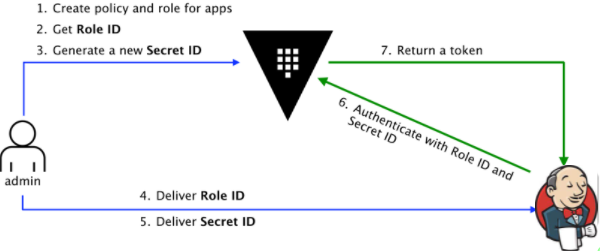

# PoC Jenkins integrado con Hashicorp Vault
La presente PoC despliega Jenkins integrado con vault permitiendole lanzar pipelines que obtengan secretos desde Hashicorp Vault
desde PODs en modo slave con base en imagenes de Skopeo y desplegados por el Sync plugin de Openshift.

## Pre-requisitos
- Vault instalado y en estado "unseal".
- Root token de Hashicorp Vault.
- Openshift en version 4.6 como minimo.
- CLI de OCP.

### Pasos para replicar la presente PoC
- Crear un directorio donde trabajaremos
```sh
mkdir poc
```
- Clonar el repositorio hacia el directorio previamente creado https://github.com/martingaryulo/vault-jenkins-poc.git 

```sh
git clone https://github.com/martingaryulo/vault-jnkins-poc.git poc/
```

- Ejecutar el bash script "setup_jenkins.sh" ubicado en bin/ pasandole los siguientes parametros como argumentos en este mismo orden:

REPO_PIPELINE= https://github.com/martingaryulo/vault-jenkins-poc.git

CONTEXT_DIR_PIPELINE= example03

VAULT_ADDR= https://vault.apps.cluster-lb9e59.lb9e59.sandbox2240.opentlc.com

VAULT_TOKEN= s.niLyk4xPNUYXZacwgGRHdiCp

OCP_TOKEN


### *Revisando en detalle cada uno de estos parametros*

**REPO_PIPELINE**= Es el presente repositorio del cual obtendremos los archivos necesarios para realizar el despliegue inicial de Jenkins, la configuracion de Hashicorp Vault con APPROLE como metodo de autentificacion y el pipeline que terminara desplegando la aplicacion de ejemplo.

**CONTEXT_DIR_PIPELINE**= Sera el directorio que definiremos como contexto para la ejecucion del pipeline

**VAULT_ADDR**= Es la ruta del servicio de Hashicorp Vault la cual obtendremos desde *Networking -> Routes* en nuestra consola de OCP. Ademas la misma debera de estar declarada como variable de entorno donde Hashicorp Vault se este ejecutando.

**VAULT_TOKEN**= El root token que obtendremos al despliegue inicial de Hashicorp Vault.

**OCP_TOKEN**= Esta variable la obtendremos directamente desde la consola de Openshift.

Ejemplo
```sh
./setup_jenkins.sh "https://github.com/martingaryulo/vault-jenkins-poc.git" "example03" "https://vault.apps.cluster-lb9e59.lb9e59.sandbox2240.opentlc.com" "s.someshamirtoken" "oc login --token=sha256~sometoken --server=https://api.cluster-lb9e59.lb9e59.sandbox2240.opentlc.com:6443"   
```
## Comprendiendo el archvio bin/setup_jenkins.sh

Ahora pasaremos a revisar con mayor detenimiento que es lo que hace este archivo.

- Creacion de un nuevo projecto donde se desplegara Jenkins y la aplicacion de ejemplo
```sh
oc new-project vault-jenkins --display-name="from Git Repo ${REPO_PIPELINE} Context Dir ${CONTEXT_DIR_PIPELINE}"
```
- Build de una imagen custom de Jenkins con Skopeo como utilidad para administrar imagenes.

```sh
oc new-build --strategy=docker -D $'FROM registry.access.redhat.com/ubi8/go-toolset:latest as builder\n
ENV SKOPEO_VERSION=v1.0.0\n
RUN git clone -b $SKOPEO_VERSION https://github.com/containers/skopeo.git && cd skopeo/ && make binary-local DISABLE_CGO=1\n
FROM image-registry.openshift-image-registry.svc:5000/openshift/jenkins-agent-maven:v4.0 as final\n
USER root\n
RUN mkdir /etc/containers\n
COPY --from=builder /opt/app-root/src/skopeo/default-policy.json /etc/containers/policy.json\
COPY --from=builder /opt/app-root/src/skopeo/skopeo /usr/bin\n
USER 1001' --name=maven-skopeo-agent -n vault-jenkins
```

- Crea el configmap para que Jenkins utilizando Skopeo deploye PODs en slave al ejecutar pipelines
```sh
oc create -f ./manifests/agent-cm.yaml -n vault-jenkins
```
- Ejecuta el script "example03/configuration/setup_vault.sh" el cual configura el metodo APPROLE en Vault, como asi tambien sus politicas y secretos mediante http request.

```sh
chmod +x ${CONTEXT_DIR_PIPELINE}/configuration/setup_vault.sh
APPROLE=$( ${CONTEXT_DIR_PIPELINE}/configuration/setup_vault.sh ${VAULT_ADDR} ${VAULT_TOKEN} )
echo "after setup vault: "$APPROLE
ROLE_ID=$( echo $APPROLE |  awk -F ' ' '{print $1}' )
SECRET_ID=$( echo $APPROLE | awk -F ' ' '{print $2}' )
VAULT_APP_TOKEN=$( echo $APPROLE | awk -F ' ' '{print $3}' )
```
- Despliega jenkins ephemral con el metodo S2I en el projecto vault-jenkins

```sh
oc new-app jenkins-ephemeral --param JENKINS_IMAGE_STREAM_TAG=jenkins:latest -n vault-jenkins
```
- Ya con Jenkins desplegado y en "running" crea el pipeline que se ejecutara al finalizar al obtener los ID Role y Secret de Hashicorp Vault previamente configurados 

```sh
echo "apiVersion: build.openshift.io/v1
kind: BuildConfig
metadata:
  labels:
    app: ${CONTEXT_DIR_PIPELINE}-pipeline
    app.kubernetes.io/component: ${CONTEXT_DIR_PIPELINE}-pipeline
    app.kubernetes.io/instance: ${CONTEXT_DIR_PIPELINE}-pipeline
  name: ${CONTEXT_DIR_PIPELINE}-pipeline
spec:
  runPolicy: Serial
  source:
    contextDir: ${CONTEXT_DIR_PIPELINE}
    git:
      ref: master
      uri: ${REPO_PIPELINE}
    type: Git
  strategy:
    jenkinsPipelineStrategy:
      jenkinsfilePath: Jenkinsfile
      env:
      - name: VAULT_ADDR
        value: ${VAULT_ADDR}
    type: JenkinsPipeline" | oc create -f - -n vault-jenkins
```
- Finalmente el script solicita de nuestra intervencion para confirmar la ejecucion del pipeline previamente configurado.

```sh
read -r -s -p $"Press enter to run ${CONTEXT_DIR_PIPELINE}-pipeline: "
oc start-build ${CONTEXT_DIR_PIPELINE}-pipeline -n vault-jenkins
```

http://vault-app-api-vault-jenkins.apps.cluster-lb9e59.lb9e59.sandbox2240.opentlc.com/api-docs

## Configuracion del plugin de Hashicorp Vault para Jenkins




Con el plugin una vez instalado y el meteodo de autentificacion APPROLE de Hashicorp Vault activado, deberemos realizar la configuracion del plugin que permitira la integracion y administracion de secretos al ejecutar los distintos trabajos en Jenkins.
1. Primero deberemos obtener tanto el role ID como el secret ID. Esto lo imprime en pantalla al final de la ejecuccion del archivo bin/setup_jenkins.sh
Tambien se pueden consultar mediante http request de la siguiente forma:

Role ID:
curl -k -s --header "X-Vault-Token:s.someshamirtoken" https://vault.apps.cluster-someUID.someUID.sandbox####.opentlc.com/v1/auth/approle/role/jenkins-role/role-id

Secret ID: 
curl -k -s --header "X-Vault-Token: s.someshamirtoken" --request POST https://vault.apps.cluster-someUID.someUID.sandbox####.opentlc.com/v1/auth/approle/role/jenkins-role/secret-id

2. En la consola de Jenkins vamos a ir a *panel de control -> administracion -> credenciales* Alli crearemos un nuevo set de credenciales basados en Vault approle, donde ingresaremos la informacion anteriormente obtenida.
3. Luego en *panel de control -> administracion -> configurar el sistema* iremos hasta la seccion de "Vault Plugin" donde completaremos la informacion solicitada y seleccionaremos las credenciales creadas en el paso anterior.

### Documentacion

#### Hashicorp Vault
[Hashicorp-vault-plugin]

[Authenticating-applications-with-vault-approle]

[Approle-overview]


#### Openshift
[OCP-Jenkins-sync-plugin]

[OpenShift-Jenkins-Sync-Plugin-2]

#### Skopeo
[What-is-skopeo]

#### Video implementacion en otros escenarios
[HashiTalks-Vault-en-aplicaciones-de-Kubernetes]

#### Repositorios
[Repo-PoC-Jenkins]

[OCP-Vault-Poc]

[//]: #
[Authenticating-applications-with-vault-approle]: <https://www.hashicorp.com/blog/authenticating-applications-with-vault-approle>

[Hashicorp-vault-plugin]: <https://plugins.jenkins.io/hashicorp-vault-plugin/>

[Approle-overview]: <https://www.vaultproject.io/api-docs/auth/approle>

[OCP-Jenkins-sync-plugin]: <https://github.com/openshift/jenkins-sync-plugin>

[OpenShift-Jenkins-Sync-Plugin-2]: <https://docs.openshift.com/container-platform/3.11/install_config/configuring_pipeline_execution.html>

[What-is-skopeo]: <https://www.redhat.com/en/topics/containers/what-is-skopeo>

[Repo-PoC-Jenkins]: <https://github.com/martingaryulo/vault-jenkins-poc>

[OCP-Vault-Poc]: <https://github.com/ferluko/ocp-vault-poc>

[HashiTalks-Vault-en-aplicaciones-de-Kubernetes]: <https://www.youtube.com/watch?v=H8VSZN3sbJs>


